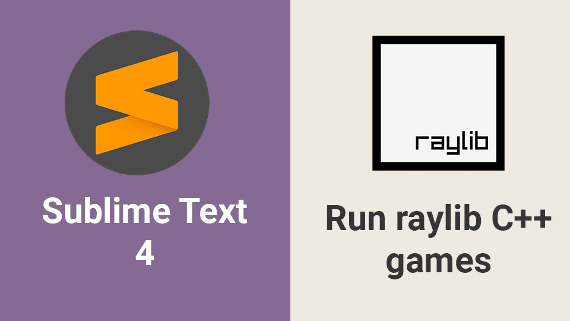

# Raylib-CPP-Starter-Template-SublimeText

Raylib C++ Starter Template for Sublime Text 4 on Windows.
This demo project contains a bouncing ball raylib example program.
It works with raylib version 4.5. Tested on both Windows 10 and Windows 11.

# How to use this template
1. Open the template folder in Sublime text.
2. Go to Tools -> Build System -> New Build System.
3. In the new build file, copy the contents of the raylib-cpp.sublime-build file included in this repository.
4. Save the new file as raylib-cpp.sublime-build
5. Go to Tools -> Build System and select raylib-cpp as the build system, if it is not already selected.
6. Press CTRL + B on the keyboard to build the project.

   Once you have created the raylib-cpp.sublime-build file, we can re-use it in all your raylib projects. This procedure must be done only once.

# Video Tutorial

  

🎥 <a href="https://youtu.be/ECnwJ5Mp-G0">Video Tutorial on YouTube</a>

 
 

| 📺 <a href="https://www.youtube.com/channel/UC3ivOTE5EgpmF2DHLBmWIWg">My YouTube Channel</a>
| 🌠<a href="http://www.educ8s.tv">My Website</a> |  

